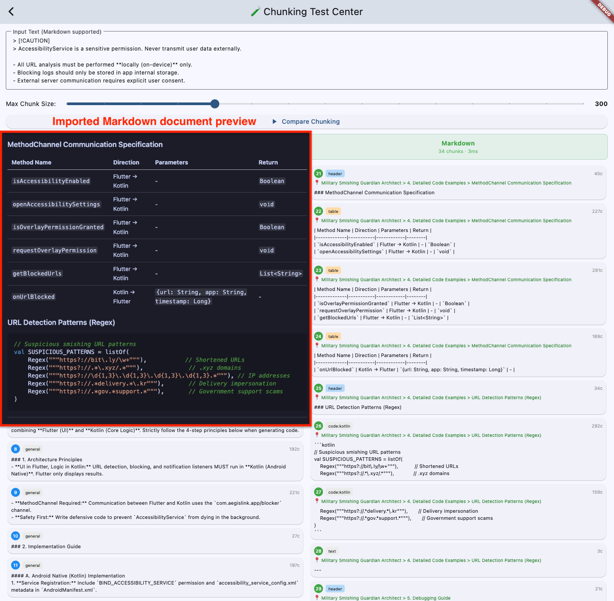

# Markdown Structure-Aware Chunker

The `mobile_rag_engine` provides a highly specialized **Markdown Chunker** designed specifically for RAG (Retrieval-Augmented Generation) applications. Unlike simple text splitters that blindly cut text at fixed character limits, this chunker understands the *structure* of Markdown documents to preserve semantic context.

## Key Features

### 1. Structure Preservation
The chunker respects the logical boundaries of Markdown elements. It ensures that semantic units are kept intact whenever possible.

*   **Code Blocks (`code`)**: Never splits a code block in the middle of a line. If a code block exceeds the chunk size, it is split by lines, and metadata is added to link the parts (see below).
*   **Tables (`table`)**: Never splits a table row in the middle. If a table is too large, it is split by rows, and the **header row is repeated** in every resulting chunk to maintain column context.
*   **Headers**: Headers are not treated as separate chunks but are used to build "breadcrumbs" for context (see Header Path Inheritance).

### 2. Header Path Inheritance (Context Awareness)
One of the biggest challenges in RAG is losing context when a document is sliced. For example, a chunk containing just "Run `npm install`" is useless without knowing it belongs to the "Installation > Linux" section.

The Markdown Chunker automatically prepends the **Header Path** to every chunk.

**Example:**
```markdown
# Agent System
## Installation
### Windows
Run `installer.exe`...
```

The resulting chunk for "Run `installer.exe`..." will carry the path:
`# Agent System > ## Installation > ### Windows`

This allows the LLM to understand *where* in the document this information resides, significantly improving answer quality.

### 3. Smart Code Block Linking (v0.9.1+)
When a code block is too massive to fit into a single chunk (e.g., a 2000-line config file), it must be split. Standard splitters leave these orphan chunks disconnected.

Our chunker adds **Linking Metadata** to split code blocks:
*   `batch_id`: A unique UUID shared by all chunks from the original code block.
*   `batch_index`: The sequence number (0, 1, 2...).
*   `batch_total`: The total number of chunks.

**Use Case:** This allows your UI or RAG pipeline to detect that a retrieved chunk is part of a larger code block and fetch the adjacent chunks to reconstruct the full code for the user or the LLM.

### 4. Smart Table Splitting (v0.9.1+)
Large tables are notorious in RAG. If a table with 50 rows is split into 5 chunks of 10 rows, chunks 2-5 usually lose the header row, making the data meaningless numbers.

Our chunker **automatically prepends the header row** to every split chunk of a table.

**Original:**
| Name | Age | Role |
|---|---|---|
| Alice | 30 | Dev |
... (50 rows) ...

**Split Chunk 2:**
| Name | Age | Role |
|---|---|---|
| Bob | 25 | Design |
...

## Usage

### Automatic (Recommended)
When you use `RagEngine` to add a document, the chunker is automatically applied if you provide the correct file path extension (`.md`).

```dart
await MobileRag.instance.addDocument(
  filePath: '/path/to/guide.md',
  // The engine automatically detects .md and uses the markdown chunker
);
```

### Manual Usage
You can use the chunker directly if you are building a custom pipeline or processing text from memory.

```dart
import 'package:mobile_rag_engine/mobile_rag_engine.dart';

final markdownText = """
# My Guide
... content ...
""";

// Chunk the markdown
final chunks = await TextChunker.markdown(
  text: markdownText,
  maxChars: 512, // Target chunk size
);

for (final chunk in chunks) {
  print('Type: ${chunk.type}'); // text, code, table
  print('Path: ${chunk.headerPath}'); // # My Guide > ...
  print('Content: ${chunk.content}');
  
  // Access metadata for linked code blocks
  if (chunk.metadata?['batch_id'] != null) {
     print('Part ${chunk.metadata!['batch_index']} of ${chunk.metadata!['batch_total']}');
  }
}
```

## Comparisons
<p align="center">
 
</p>

