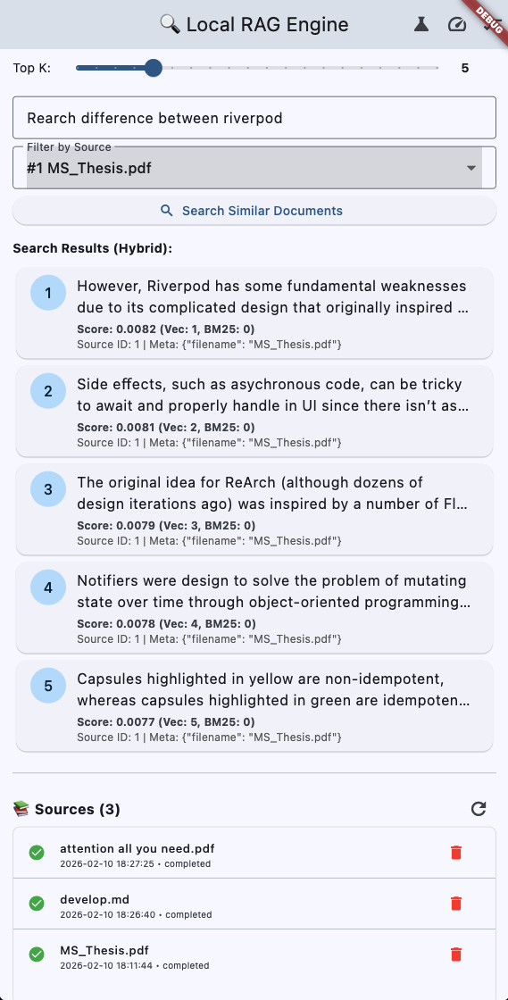
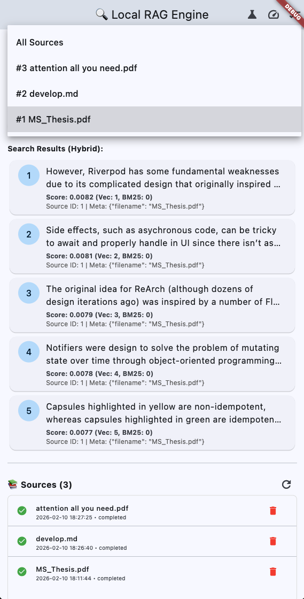

# Search by Source: Filtering Results

Mobile RAG Engine allows you to restrict search results to specific documents using the `sourceIds` parameter. This is essential for features like "Chat with PDF" or ensuring answers come only from a selected manual.

## How it Works

Every document added to the engine is assigned a unique `sourceId` (integer). When searching, you can pass a list of these IDs to tell the engine: *"Only look for chunks belonging to these sources."*

## API Usage

Both `search` and `searchHybrid` (and their usage in `searchHybridWithContext`) support the `sourceIds` parameter.

### Basic Filtering

To search within a single document:

```dart
// 1. User selects a document (Source ID: 5)
final int selectedSourceId = 5;

// 2. Search only within that document
final results = await MobileRag.instance.searchHybrid(
  'What is the refund policy?',
  sourceIds: [selectedSourceId], // Pass as a list
);
```

### Multi-Source Filtering

You can also search across a subset of documents (e.g., all manuals for a specific product):

```dart
// IDs for [Manual A, Manual B, Warranty Guide]
final productDocs = [10, 11, 12];

final results = await MobileRag.instance.searchHybrid(
  'battery replacement',
  sourceIds: productDocs,
);
```

## Implementing a "Source Selector" UI

A common pattern is a dropdown that lets users switch between "Global Search" and "Document-Specific Search".

### 1. Fetch Available Sources

First, retrieve the list of sources to populate your UI:

```dart
List<SourceEntry> _sources = [];

Future<void> _loadSources() async {
  // Returns: id, name, metadata, status, etc.
  _sources = await MobileRag.instance.listSources();
  setState(() {});
}
```

### 2. Build the Dropdown

Here is a Flutter example (based on the provided example app) for a source selection dropdown:

```dart
int? _selectedSourceId; // null = All Sources

DropdownButton<int?>(
  value: _selectedSourceId,
  isExpanded: true,
  items: [
    // Option 1: All Sources (Default)
    const DropdownMenuItem<int?>(
      value: null,
      child: Text('All Sources'),
    ),
    // Option 2+: Individual Documents
    ..._sources.map(
      (source) => DropdownMenuItem<int?>(
        value: source.id.toInt(),
        child: Text(
          '#${source.id} ${source.name ?? "Untitled"}',
          overflow: TextOverflow.ellipsis,
        ),
      ),
    ),
  ],
  onChanged: (value) {
    setState(() => _selectedSourceId = value);
  },
)
```

### 3. Pass Selection to Search

When triggering the search, conditionally include the `sourceIds` parameter:

```dart
Future<void> _search() async {
  final query = _queryController.text;
  
  // If _selectedSourceId is null, pass null to search everywhere.
  // If it has a value, wrap it in a list.
  final filter = _selectedSourceId != null ? [_selectedSourceId!] : null;

  final results = await MobileRag.instance.searchHybrid(
    query,
    sourceIds: filter,
  );
  
  // ... process results
}
```

## Use Cases & Benefits

| Feature | Why use Source Filtering? |
| :--- | :--- |
| **Chat with Document** | Allows users to upload a PDF and ask questions *only* about that PDF, ignoring other documents in the database. |
| **Context Switching** | If your app supports multiple projects or workspaces, use source IDs to isolate search to the active workspace without needing separate databases. |
| **Performance** | Searching a subset of the index is generally faster, as the engine skips irrelevant chunks immediately. |
| **Precision** | Prevents "hallucinations" or irrelevant answers from unrelated documents (e.g., searching for "setup" in a router manual won't return results from a microwave manual). |
| **Exact Recall** | When searching a single document, the engine can switch to an exhaustive scan, guaranteeing 100% recall even for obscure queries that might be missed by an approximate global search. |

## Notes

- **Source ID Persistence**: Source IDs are stable within the SQLite database. However, if you delete and re-add a document, it will get a *new* Source ID.
- **Metadata**: You can store custom metadata (e.g., `{"category": "finance"}`) when adding documents, but currently, native filtering is strictly by `sourceId`. You can use `listSources()` to find all IDs matching your metadata criteria in Dart, and then pass those IDs to the search function.

## Screenshots

<p align="center">
   &nbsp; &nbsp; 
</p>
