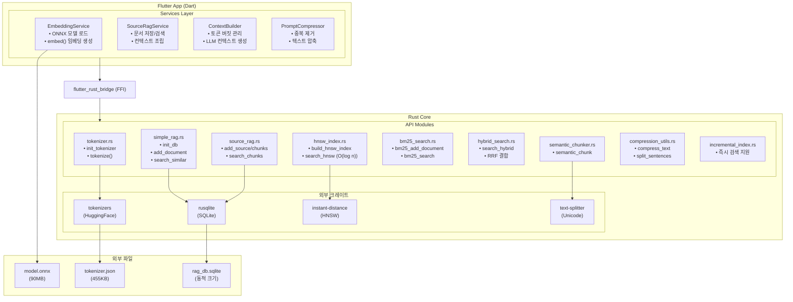
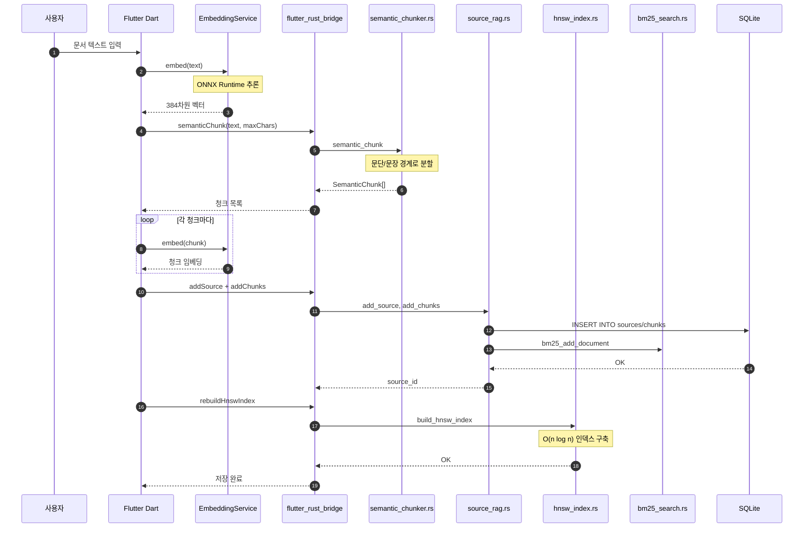
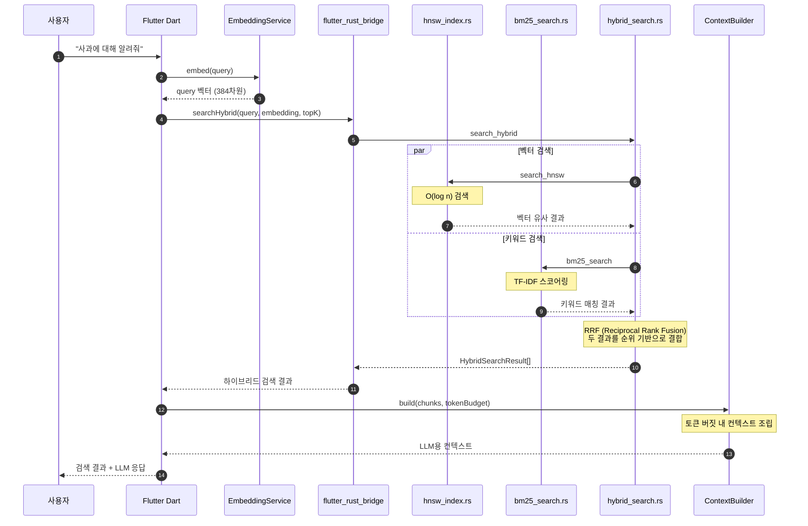

# Mobile RAG Engine 아키텍처 가이드

전체 시스템이 어떻게 연동되는지 설명하는 문서입니다.

---

## 시스템 아키텍처



---

## 데이터 흐름

### 1. 문서 저장 플로우



### 2. 검색 플로우 (하이브리드 검색)



---

## 파일 구조

```
mobile_rag_engine/
├── lib/
│   ├── main.dart                    # Flutter UI (Demo)
│   ├── mobile_rag_engine.dart       # Package exports
│   ├── services/
│   │   ├── embedding_service.dart   # ONNX 임베딩 (Flutter 레이어)
│   │   ├── context_builder.dart     # LLM 컨텍스트 조립
│   │   ├── source_rag_service.dart  # 고수준 RAG API
│   │   ├── prompt_compressor.dart   # 프롬프트 압축
│   │   ├── benchmark_service.dart   # 성능 벤치마크
│   │   └── quality_test_service.dart # 품질 테스트
│   └── src/rust/api/
│       ├── simple_rag.dart          # FFI bindings (단순 API)
│       ├── source_rag.dart          # FFI bindings (청킹 API)
│       ├── semantic_chunker.dart    # FFI bindings (청킹)
│       ├── hnsw_index.dart          # FFI bindings (HNSW)
│       ├── bm25_search.dart         # FFI bindings (BM25)
│       ├── hybrid_search.dart       # FFI bindings (하이브리드)
│       └── compression_utils.dart   # FFI bindings (압축)
│
├── rust/
│   ├── Cargo.toml                   # Rust 의존성
│   └── src/
│       ├── lib.rs
│       └── api/
│           ├── mod.rs
│           ├── simple_rag.rs        # SQLite + 코사인 유사도
│           ├── source_rag.rs        # Source/Chunk 기반 RAG
│           ├── tokenizer.rs         # HuggingFace tokenizers
│           ├── hnsw_index.rs        # HNSW 벡터 인덱스 (O(log n))
│           ├── bm25_search.rs       # BM25 키워드 검색
│           ├── hybrid_search.rs     # 하이브리드 검색 + RRF
│           ├── semantic_chunker.rs  # Unicode 시맨틱 청킹
│           ├── compression_utils.rs # 텍스트 압축
│           └── incremental_index.rs # 증분 인덱싱
│
├── assets/
│   ├── tokenizer.json               # WordPiece vocab (455KB)
│   └── model.onnx                   # MiniLM-L6-v2 (90MB)
│
├── local-gemma-macos/               # macOS 테스트 앱 (Ollama 연동)
│   └── lib/screens/
│       └── rag_chat_screen.dart     # RAG + Ollama 채팅
│
├── test_app/                        # 테스트 앱 (flutter_gemma 연동)
│   └── lib/screens/
│       ├── rag_chat_screen.dart     # RAG + LLM 채팅
│       └── model_setup_screen.dart  # 모델 다운로드 화면
│
└── docs/
    ├── project-introduce.md         # 프로젝트 소개 (면접용)
    └── guides/
        ├── architecture_guide.md    # 이 문서
        └── v0.3.0_semantic_chunking_update.md
```

---

## 초기화 순서

```dart
1. RustLib.init()           // flutter_rust_bridge 초기화
       ↓
2. Asset 복사               // tokenizer.json, model.onnx → Documents
       ↓
3. initTokenizer()          // Rust: tokenizer.json 로드
       ↓
4. EmbeddingService.init()  // Flutter: ONNX 모델 로드 (약 2-3초)
       ↓
5. SourceRagService.init()  // DB 초기화 + HNSW/BM25 인덱스 로드
       ↓
   ✅ 준비 완료
```

> **Note**: ONNX 추론은 Rust에서 Flutter 레이어로 이동되었습니다.
> 이는 iOS/macOS 호환성과 모델 관리 유연성을 위한 결정입니다.

---

## 핵심 함수 연동 표

### Simple API (v0.1.0)
| Dart 호출 | Rust 함수 | 의존성 |
|-----------|-----------|--------|
| `initDb()` | `simple_rag::init_db` | rusqlite |
| `initTokenizer()` | `tokenizer::init_tokenizer` | tokenizers |
| `tokenize()` | `tokenizer::tokenize` | tokenizers |
| `addDocument()` | `simple_rag::add_document` | rusqlite + bm25 |
| `searchSimilar()` | `simple_rag::search_similar` | rusqlite + hnsw |

### Source RAG API (v0.2.0+)
| Dart 호출 | Rust 함수 | 의존성 |
|-----------|-----------|--------|
| `addSource()` | `source_rag::add_source` | rusqlite |
| `addChunks()` | `source_rag::add_chunks` | rusqlite |
| `searchChunks()` | `source_rag::search_chunks` | rusqlite + HNSW |
| `rebuildChunkHnswIndex()` | `source_rag::rebuild_chunk_hnsw_index` | instant-distance |

### Semantic Chunking API (v0.3.0)
| Dart 호출 | Rust 함수 | 의존성 |
|-----------|-----------|--------|
| `semanticChunk()` | `semantic_chunker::semantic_chunk` | text-splitter |
| `semanticChunkWithOverlap()` | `semantic_chunker::semantic_chunk_with_overlap` | text-splitter |

### HNSW Index API (v0.4.0+)
| Dart 호출 | Rust 함수 | 의존성 |
|-----------|-----------|--------|
| `buildHnswIndex()` | `hnsw_index::build_hnsw_index` | instant-distance |
| `searchHnsw()` | `hnsw_index::search_hnsw` | instant-distance |
| `isHnswIndexLoaded()` | `hnsw_index::is_hnsw_index_loaded` | - |

### BM25 Search API (v0.4.0+)
| Dart 호출 | Rust 함수 | 의존성 |
|-----------|-----------|--------|
| `bm25AddDocument()` | `bm25_search::bm25_add_document` | - |
| `bm25Search()` | `bm25_search::bm25_search` | - |
| `isBm25IndexLoaded()` | `bm25_search::is_bm25_index_loaded` | - |

### Hybrid Search API (v0.4.0+)
| Dart 호출 | Rust 함수 | 의존성 |
|-----------|-----------|--------|
| `searchHybrid()` | `hybrid_search::search_hybrid` | hnsw + bm25 |
| `searchHybridWeighted()` | `hybrid_search::search_hybrid_weighted` | hnsw + bm25 |

### Compression API (v0.5.0+)
| Dart 호출 | Rust 함수 | 의존성 |
|-----------|-----------|--------|
| `compressText()` | `compression_utils::compress_text` | - |
| `splitSentences()` | `compression_utils::split_sentences` | - |
| `shouldCompress()` | `compression_utils::should_compress` | - |

---

## 성능 특성

| 작업 | 예상 시간 | 복잡도 | 참고 |
|------|-----------|--------|------|
| 모델 초기화 | 2-3초 | - | 앱 시작 시 1회 |
| 토큰화 | ~0.8ms | O(n) | Rust HuggingFace |
| 임베딩 생성 | 4-36ms | O(n) | 텍스트 길이에 따라 |
| DB 저장 | <5ms | O(1) | 단일 INSERT |
| **HNSW 검색** | **~1ms** | **O(log n)** | ✅ 구현 완료 |
| BM25 검색 | ~5ms | O(terms × docs) | 키워드 매칭 |
| 하이브리드 검색 | ~10ms | O(log n) | HNSW + BM25 + RRF |

---

## 핵심 알고리즘

### HNSW (Hierarchical Navigable Small World)

```rust
// hnsw_index.rs
pub struct EmbeddingPoint {
    pub id: i64,
    pub embedding: Vec<f32>,
    pub norm: f32,  // 사전 계산된 norm
}

impl instant_distance::Point for EmbeddingPoint {
    fn distance(&self, other: &Self) -> f32 {
        // Cosine Distance = 1 - Cosine Similarity
        let dot: f32 = self.embedding.iter()
            .zip(other.embedding.iter())
            .map(|(a, b)| a * b)
            .sum();
        let similarity = dot / (self.norm * other.norm);
        1.0 - similarity
    }
}
```

### RRF (Reciprocal Rank Fusion)

```rust
// hybrid_search.rs
fn rrf_score(rank: usize, k: u32) -> f64 {
    1.0 / (k as f64 + rank as f64)
}

// 하이브리드 점수 = weight_vec * RRF(vec_rank) + weight_bm25 * RRF(bm25_rank)
```

---

## 향후 개선 포인트

1. ~~**HNSW 벡터 인덱싱**~~ ✅ 완료
2. ~~**BM25 키워드 검색**~~ ✅ 완료
3. ~~**하이브리드 검색**~~ ✅ 완료
4. **모델 양자화**: 90MB → ~25MB (INT8 양자화)
5. **배치 임베딩**: 여러 문장 동시 처리
6. **캐싱**: 동일 쿼리 결과 캐싱
7. **스트리밍 검색**: 대용량 문서 점진적 처리
