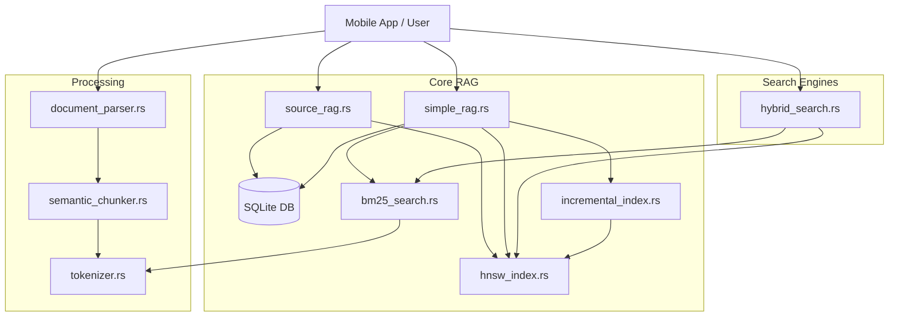

# Mobile RAG Engine Architecture

This document describes the architectural components, module responsibilities, and function interdependencies of the Mobile RAG Engine.

## High-Level Overview

The engine is designed as a modular Rust library optimized for mobile use via Flutter Rust Bridge (FRB). It provides a complete RAG (Retrieval-Augmented Generation) pipeline, including document parsing, chunking, indexing, and hybrid search (Vector + Keyword).

## Core Modules

### 1. RAG Implementations

#### `simple_rag.rs` (Basic RAG)
A lightweight RAG implementation suitable for simple use cases.
-   **Storage:** Single SQLite table `docs` (content, hash, embedding).
-   **Indexing:** Manages both HNSW (Vector) and BM25 (Keyword) indexes.
-   **Key Functions:**
    -   `add_document`: Adds a doc to SQLite, updates BM25, and adds to incremental buffer.
    -   `search_similar`: Performs HNSW search, falling back to linear scan if needed.
    -   `rebuild_hnsw_index` / `rebuild_bm25_index`: Full index reconstruction.

#### `source_rag.rs` (Advanced RAG)
The primary RAG implementation supporting hierarchical data (Sources -> Chunks).
-   **Storage:** Two SQLite tables:
    -   `sources`: Original document metadata.
    -   `chunks`: Individual text chunks with embeddings.
-   **Indexing:** Chunk-level HNSW indexing.
-   **Key Functions:**
    -   `add_source`: Creates a source entry.
    -   `add_chunks`: transactional insertion of chunks.
    -   `search_chunks`: Vector search over chunks.
    -   `rebuild_chunk_hnsw_index`: Rebuilds HNSW index from the `chunks` table.

### 2. Indexing & Search

#### `hnsw_index.rs` (Vector Search)
Wraps the `hnsw_rs` crate for approximate nearest neighbor search.
-   **State:** Thread-safe global static `HNSW_INDEX`.
-   **Persistence:** Supports saving/loading index markers (rebuilds from DB on mobile).
-   **Key Functions:** `build_hnsw_index`, `search_hnsw`.

#### `bm25_search.rs` (Keyword Search)
In-memory implementation of the BM25 ranking algorithm.
-   **State:** Thread-safe global static `INVERTED_INDEX`.
-   **Key Functions:** `bm25_add_document`, `bm25_search`.

#### `hybrid_search.rs` (Fused Search)
Combines Vector and Keyword search results using Reciprocal Rank Fusion (RRF).
-   **Logic:**
    1.  Fetch top-K results from `hnsw_index`.
    2.  Fetch top-K results from `bm25_search`.
    3.  Compute RRF scores: `1 / (k + rank)`.
    4.  Sort and return unified results.

#### `incremental_index.rs` (Real-time Updates)
Manages a temporary buffer for new vectors before they are merged into the main index.
-   **Strategy:** Dual-search (Buffer + Main Index).
-   **Key Functions:** `incremental_add`, `incremental_search` (searches both buffer and HNSW).

### 3. Data Processing Pipeline

#### `document_parser.rs` (Ingestion)
Extracts raw text from binary file formats.
-   **Supported Formats:** PDF, DOCX.
-   **Key Features:** Smart page joining (de-hyphenation), page number removal.

#### `semantic_chunker.rs` (Chunking)
Splits text into semantically meaningful units.
-   **Strategies:**
    -   `semantic_chunk`: Paragraph-based splitting with semantic type classification (Definition, List, etc.).
    -   `markdown_chunk`: Structure-aware splitting that preserves Markdown hierarchy (Headers, Code blocks, Tables).

#### `tokenizer.rs` (Tokenization)
Wraps HuggingFace `tokenizers` for text-to-vector preparation.
-   **Key Functions:** `tokenize` (returns IDs), `decode_tokens`.

### 4. Utilities

#### `user_intent.rs` (Command Parsing)
Parses user slash commands (e.g., `/summary`, `/define`) to determine intent.

#### `compression_utils.rs` (Optimization)
Compresses text for LLM context windows by removing duplicates and optionally stop-words.

## Dependency Graph

## Function Call Flow Example: Adding a Document

1.  **Parse:** `extract_text_from_document` (PDF/DOCX -> String).
2.  **Chunk:** `markdown_chunk` (String -> Vec<StructuredChunk>).
3.  **Embed:** (External Model) -> Vec<f32>.
4.  **Store:** `add_source` + `add_chunks` (Write to SQLite).
5.  **Index:**
    *   `rebuild_chunk_hnsw_index` (if batch).
    *   `incremental_add` (if single real-time).

## Function Call Flow Example: Hybrid Search

1.  **User Query:** "How does the engine work?"
2.  **Intent:** `parse_user_intent` -> `General`.
3.  **Embed Query:** (External Model) -> Vec<f32>.
4.  **Search:** `search_hybrid(query_text, query_vec)`.
    *   Parallel Call 1: `search_hnsw(query_vec)`.
    *   Parallel Call 2: `bm25_search(query_text)`.
5.  **Fusion:** Compute RRF scores, sort, and fetch content from SQLite.
