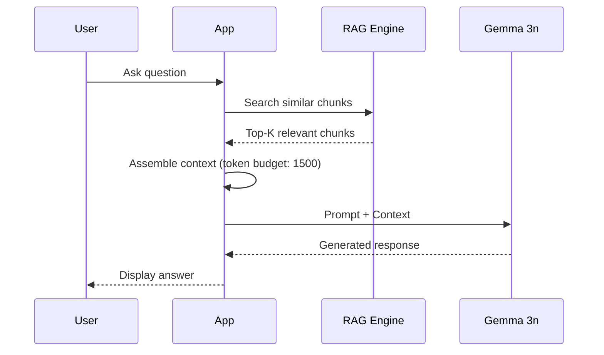

# RAG + Gemma Test App

A demonstration app showcasing on-device RAG (Retrieval-Augmented Generation) with Gemma 3n LLM integration.

## What This App Does

```
📄 Documents → 🔄 Semantic Chunking → 🧮 Embeddings → 💾 Vector DB
                                                           ↓
🤖 Gemma 3n ← 📝 Prompt + Context ← 🔍 HNSW Search ← ❓ User Query
```

This app runs a complete RAG pipeline **entirely on-device**:
- No cloud APIs required
- Works offline
- Data never leaves the device

## Features

| Feature | Description |
|---------|-------------|
| 📚 Document Management | Add, store, and manage documents with automatic semantic chunking |
| 🔍 Semantic Search | HNSW-based vector similarity search with O(log n) performance |
| 🤖 Local LLM | On-device inference using Gemma 3n via `flutter_gemma` |
| 💬 RAG Chat | Context-aware responses using retrieved document chunks |
| 🔧 Model Management | Download, switch, or delete LLM models |

## Architecture

### Core Components

1. **mobile_rag_engine** - Rust-powered RAG engine
   - Tokenization: HuggingFace `tokenizers` crate
   - Embeddings: ONNX Runtime with MiniLM-L6-v2
   - Vector Storage: SQLite with HNSW indexing
   - Chunking: Unicode-based semantic chunking

2. **flutter_gemma** - On-device LLM inference
   - Supports Gemma 3n models (1B, E2B, E4B)
   - GPU acceleration via MediaPipe
   - Persistent chat sessions for conversation context

### Data Flow



## Setup

### Prerequisites

- Flutter 3.19+
- Xcode 15+ (for iOS)
- HuggingFace account with token

### Installation

1. **Clone and navigate**
   ```bash
   cd mobile_rag_engine/test_app
   ```

2. **Create environment file**
   ```bash
   echo "HUGGINGFACE_TOKEN=your_token_here" > assets/.env
   ```

3. **Install dependencies**
   ```bash
   flutter pub get
   ```

4. **Run the app**
   ```bash
   flutter run
   ```

### First Launch

1. The app will prompt you to download a Gemma model
2. Available models:
   - **Gemma 3n 2B Q4** (~1.4 GB) - Balanced performance
   - **Gemma 3n E2B** (~1.5 GB) - Enhanced 2B
   - **Gemma 3n E4B** (~2.8 GB) - Larger, more capable

3. After download, you can start chatting with RAG-powered responses

## Usage

### Adding Documents

1. Tap the **📎** button in the chat input
2. Enter or paste your document text
3. The document is automatically:
   - Split into semantic chunks
   - Embedded into 384-dim vectors
   - Stored in the local SQLite database

### Asking Questions

1. Type your question in the chat input
2. The app will:
   - Search for relevant document chunks
   - Assemble context within token budget
   - Generate a response using Gemma

### Settings Menu

| Option | Action |
|--------|--------|
| Add Sample Docs | Load preset documents for testing |
| New Chat | Reset LLM session and clear context |
| Clear Documents | Delete all stored RAG data |
| Delete Model | Remove downloaded LLM |
| Change Model | Switch to a different Gemma variant |

## Performance

Tested on iPhone 14 Pro:

| Operation | Time |
|-----------|------|
| Tokenization | ~1ms |
| Embedding (short text) | ~5ms |
| HNSW Search (100 docs) | ~1ms |
| LLM Response (first token) | ~500ms |
| LLM Response (total) | 2-5s |

## Known Limitations

1. **Context Window**: Gemma 3n supports 2048 tokens. Long conversations may cause context overflow.
2. **Model Size**: LLM models require 1-3 GB storage.
3. **Memory**: Larger models may strain devices with limited RAM.

## Troubleshooting

### Empty responses
- The context may have overflowed. Use "New Chat" to reset the session.

### Slow initial response
- First inference after model load is slower due to GPU initialization.

### Model download fails
- Check your HuggingFace token in `assets/.env`
- Ensure stable internet connection

## Tech Stack

- **Flutter** - UI framework
- **Rust** (via `flutter_rust_bridge`) - Performance-critical RAG operations
- **ONNX Runtime** - Embedding model inference
- **SQLite** - Vector storage with HNSW indexing
- **flutter_gemma** - On-device LLM inference

## Related

- [mobile_rag_engine](../) - The core RAG package
- [Architecture Guide](../docs/guides/architecture_guide.md) - Detailed system design
- [v0.3.0 Semantic Chunking](../docs/guides/v0.3.0_semantic_chunking_update.md) - Chunking implementation

## License

MIT
